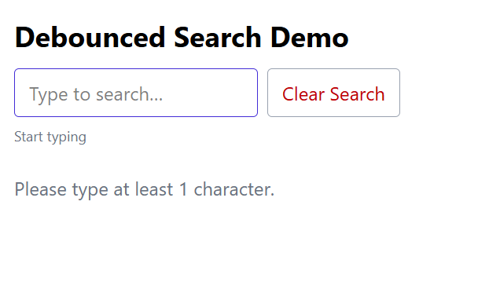

# Pokémon Search (React + Vite + TS)

Debounced search with local caching and PokéAPI data.

- Debounce + cancel guards
- In-memory result cache
- Tailwind v4 styling

A small React + TypeScript + Vite app demonstrating debounced API search with caching.

# Before searching

# After Searching

